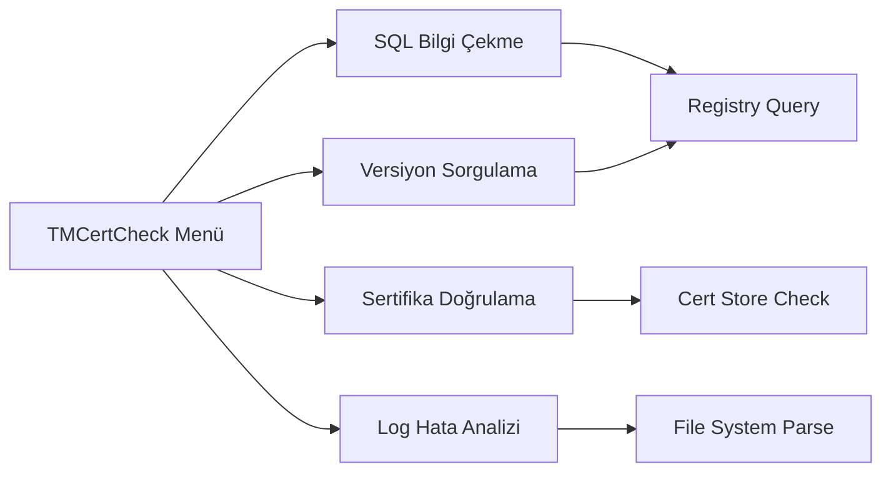

# TMCertCheck.ps1 Kullanım Kılavuzu

`TMCertCheck.ps1`, Trend Micro Apex One ve Apex Central yönetimi için kritik yardımcı araçları (utility functions) barındıran kapsamlı bir kütüphanedir.

## 📋 Genel Bakış

Bu araç, SQL bağlantı bilgilerinden ajan versiyon sorgulamaya, sertifika doğrulamalarından log hata analizine kadar geniş bir yelpazede diagnostic işlemlerini kolaylaştırır.

### 🎨 Görsel Standartlar (Mebadi-i Aşere v2)

Bu kütüphanedeki tüm fonksiyonlar, Mebadi-i Aşere v2 standartlarına uygun olarak tasarlanmış merkezi yönetim paneliyle (TMMain) tam uyumludur. İşlem sonlarında standart cevherhane alt bilgisi (footer) görüntülenir.

## 🛠 Kullanım

### İnteraktif Kullanım (Menü)

```powershell
.\TMCertCheck.ps1
```

### Script İçinden Kullanım (Kütüphane)

Fonksiyonları kendi scriptlerinizde kullanmak için "dot-sourcing" yapabilirsiniz:

```powershell
. .\TMCertCheck.ps1
$sql = Get-A1SQLInfo
Write-Host "Kullanılan DB: $($sql.DBName)"
```

## 📊 Akış Diyagramı (Toolbox)



## ⚙️ Fonksiyonlar ve Özellikler (v1.1.0)

| Fonksiyon | Açıklama | Kaynak / Hedef |
| :--- | :--- | :--- |
| **`Get-A1SQLInfo`** | SQL Server adı ve DB ismini çeker. | `HKLM\...\TVCS` |
| **`Get-A1AgentVersion`** | Makinede yüklü olan ajan sürümünü döndürür. | `HKLM\...\Uninstall\ApexOneNT` |
| **`Test-A1Certificates`** | IP ve OfcOSF sertifikalarını Personal/Trusted People depolarında kontrol eder. | Windows Certificate Store |
| **`Export-A1LogErrors`** | Kritik loglardaki `error`, `fail`, `warning` ifadelerini ayıklar. | `C:\Windows\OFCMAS.log` vb. |

## 🔍 Detaylı Detaylar

### 🛡️ Sertifika Kontrolü (FCC)

`Test-A1Certificates` fonksiyonu:

- Sunucunun birincil IPv4 adresini otomatik tespit eder.
- "Personal" deposunda IP ile uyumlu sertifika arar.
- "Trusted People" deposunda hem IP hem de `OfcOSFWebApp` sertifikalarını doğrular.
- Sonuçları PASS/FAIL olarak renklendirilmiş şekilde görüntüler.

### 📝 Log Analizi

`Export-A1LogErrors` fonksiyonu:

- `OFCMAS.log`, `OFCSVR.log` ve `TMPatch.log` dosyalarını tarar.
- Bulunan hataları `C:\A1\LogErr` klasörüne temizlenmiş raporlar halinde döker.
- Hata ayıklama (debugging) süresini %80 oranında azaltır.

## 🔐 Sistem Modifikasyonları

- **Salt-Okunur İşlemler**: Bu script salt-okunur (read-only) modda çalışır; sistem ayarlarını **değiştirmez**. Sadece `C:\A1\LogErr` dizini yoksa oluşturur ve rapor dosyalarını buraya yazar.
- **Execution Policy**: Sistem politikasını kalıcı olarak değiştirmez.

> "Sübhaneke la ilmelena illa ma allemtena inneke entel alimul hakîm. (Bakara, 32)"
