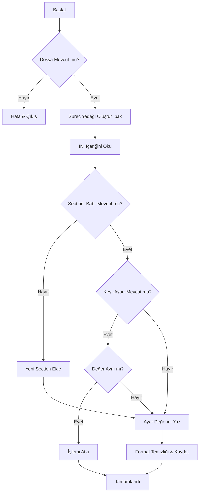

# TMConfigCheck.ps1 Kullanım Kılavuzu

`TMConfigCheck.ps1`, Trend Micro Apex One ve Apex Central yapılandırma dosyalarını (`ofcscan.ini`, `ofcserver.ini`) güvenli ve kontrollü bir şekilde güncellemek için tasarlanmış bir otomasyon aracıdır.

## 📋 Genel Bakış

Bu script, kritik `.ini` dosyalarında manuel düzenleme yaparken oluşabilecek syntax hatalarını ve format bozulmalarını önler. Her işlemden önce otomatik yedekleme yapar ve INI "Bab" (Section) yapısını korur.

## 🛠 Kullanım

### İnteraktif Mod (Önerilen)

Sık kullanılan ayarları (USB Logging, Purge Alert vb.) menüden seçerek uygulamak için:

```powershell
.\TMConfigCheck.ps1 -Interactive
```

### Parametrik Mod (Komut Satırı)

Gelişmiş kullanım ve script entegrasyonları için:

```powershell
.\TMConfigCheck.ps1 -FilePath "C:\ofcscan.ini" -Section "Global Setting" -Key "EnableUsbLogging" -Value "1"
```

## 📊 Akış Diyagramı (Configuration Workflow)



## ⚙️ Parametreler ve Değişkenler

### Parametre Listesi

| Parametre | Zorunlu mu? | Açıklama |
| :--- | :--- | :--- |
| `-FilePath` | Evet (Parametrik modda) | Hedef INI dosyasının tam yolu. |
| `-Section` | Evet (Parametrik modda) | İlgili INI Bab başlığı (örn: "Global Setting"). |
| `-Key` | Evet (Parametrik modda) | Güncellenecek anahtar (örn: "EnableUsbLogging"). |
| `-Value` | Evet (Parametrik modda) | Atanacak yeni değer (örn: "1"). |
| `-Interactive` | Hayır | Menü arayüzünü açar. |
| `-Force` | Hayır | Değer aynı olsa bile dosyayı tekrar yazar. |
| `-NoBackup` | Hayır | `.bak` yedeği almadan işlemi gerçekleştirir. |

### Fonksiyonlar

- **`Invoke-Update`**: Scriptin kalbidir. Dosya okuma, yedekleme, section/key arama ve yazma işlemlerini yönetir.
- **`Start-InteractiveConfig`**: Kullanıcıya hazır şablonlar sunan menü arayüzü.

## 🔐 Sistem Modifikasyonları ve Güvenlik

1. **Güvenli Yedekleme**: Her güncelleme öncesi `dosya.ini-YYYYMMDD_HHmm.bak` adında bir kopya oluşturulur.
2. **Format Koruması**: Ardışık boş satırları temizler ve dosyanın UTF-8 (BOM) yapısını korur.
3. **Hata Yönetimi**: Beklenmedik durumlarda `try/catch` blokları ile işlemi güvenli bir şekilde sonlandırır.

## 💡 Önemli Not

Eğer belirtilen `[Section]` dosyada bulunmuyorsa, script bu bölümü dosyanın en sonuna otomatik olarak ekler.
