# TMConfigCheck.ps1 Kullanım Kılavuzu

`TMConfigCheck.ps1`, Trend Micro Apex One ve Apex Central yapılandırma dosyalarını (`ofcscan.ini`, `ofcserver.ini`) güvenli ve kontrollü bir şekilde güncellemek için tasarlanmış bir otomasyon aracıdır.

## 📋 Genel Bakış

Bu script, kritik `.ini` dosyalarında manuel düzenleme yaparken oluşabilecek syntax hatalarını ve format bozulmalarını önler. Her işlemden önce otomatik yedekleme yapar ve INI "Bab" (Section) yapısını korur.

### ⚙️ Konsolidasyon (v3.1.0)

v3.1.0 sürümü ile birlikte eski `v1`, `v2` ve `v3` sürümlerindeki tüm özellikler bu dosyada birleştirilmiştir. Artık farklı sürümler arasında geçiş yapmaya gerek kalmadan tüm konfigürasyon işlemlerini tek bir araç üzerinden yönetebilirsiniz.

## 🛠 Kullanım

### İnteraktif Mod (Önerilen)

Tüm gelişmiş ayarlar tek bir interaktif menüde toplanmıştır. Menü, işlem bittikten sonra ana ekrana döner (`Loop`) ve Enter tuşuna basana kadar sonucu ekranda tutar.

1. **USB Logging Etkinleştir**: Global Setting altındaki USB log takibi.
2. **Client Unload Etkinleştir**: Sunucu konsolundan ajan kaldırma izni.
3. **Inactive Agent Purge FULL Bildirimleri**: Temizlenen ajanlar için zengin SMTP/Event log bildirimleri.
4. **Global Güvenlik & Optimizasyon**: `VsapiNtkdControlFlag`, `WatchDogSPLog` gibi kritik sistem ayarları.

```powershell
.\TMConfigCheck.ps1
# Veya parametre ile belirtmek için:
.\TMConfigCheck.ps1 -Interactive
```

### Parametrik Mod (Komut Satırı)

Gelişmiş kullanım ve script entegrasyonları için:

```powershell
.\TMConfigCheck.ps1 -FilePath "C:\ofcscan.ini" -Section "Global Setting" -Key "EnableUsbLogging" -Value "1"
```

## 📊 Akış Diyagramı (Configuration Workflow)

```mermaid
graph TD
    Start[Başlat] --> Validate{Dosya Mevcut mu?}
    Validate -- Hayır --> Error[Hata & Çıkış]
    Validate -- Evet --> Backup[Süreç Yedeği Oluştur .bak]
    
    Backup --> Read[INI İçeriğini Oku]
    Read --> SecCheck{Section -Bab- Mevcut mu?}
    
    SecCheck -- Hayır --> AddSec[Yeni Section Ekle]
    SecCheck -- Evet --> KeyCheck{Key -Ayar- Mevcut mu?}
    
    AddSec --> Update[Ayar Değerini Yaz]
    KeyCheck -- Evet --> ValCheck{Değer Aynı mı?}
    KeyCheck -- Hayır --> Update
    
    ValCheck -- Evet --> Skip[İşlemi Atla]
    ValCheck -- Hayır --> Update
    
    Update --> Format[Format Temizliği & Kaydet]
    Skip --> End[Tamamlandı]
    Format --> End
```



## ⚙️ Parametreler ve Değişkenler

### Parametre Listesi

| Parametre | Zorunlu mu? | Açıklama |
| :--- | :--- | :--- |
| `-FilePath` | Evet (Parametrik modda) | Hedef INI dosyasının tam yolu. |
| `-Section` | Evet (Parametrik modda) | İlgili INI Bab başlığı (örn: "Global Setting"). |
| `-Key` | Evet (Parametrik modda) | Güncellenecek anahtar (örn: "EnableUsbLogging"). |
| `-Value` | Evet (Parametrik modda) | Atanacak yeni değer (örn: "1"). |
| `-Interactive` | Hayır | Menü arayüzünü açar. (Parametre girilmezse varsayılan budur). |
| `-Force` | Hayır | Değer aynı olsa bile dosyayı tekrar yazar. |
| `-NoBackup` | Hayır | `.bak` yedeği almadan işlemi gerçekleştirir. |

### Fonksiyonlar

- **`Invoke-Update`**: Scriptin kalbidir. Dosya okuma, yedekleme, section/key arama ve yazma işlemlerini yönetir.
- **`Start-InteractiveConfig`**: Kullanıcıya hazır şablonlar sunan, sürekli döngüde (`While Loop`) çalışan menü arayüzü.

## 🔐 Sistem Modifikasyonları ve Güvenlik

1. **Güvenli Yedekleme**: Her güncelleme öncesi `dosya.ini-YYYYMMDD_HHmm.bak` adında bir kopya oluşturulur.
2. **Format Koruması**: Ardışık boş satırları temizler ve dosyanın UTF-8 (BOM) yapısını korur.
3. **Execution Policy**: Sistem politikasını değiştirmez; launcher üzerinden çalıştırılması önerilir.

## 💡 Önemli Not

- Eğer belirtilen `[Section]` dosyada bulunmuyorsa, script bu bölümü dosyanın en sonuna otomatik olarak ekler.
- İşlem tamamlandıktan sonra menüye dönmek için **Enter** tuşuna basmanız beklenir; bu sayede logları okumak için vaktiniz olur.

> "Sübhaneke la ilmelena illa ma allemtena inneke entel alimul hakîm. (Bakara, 32)"
