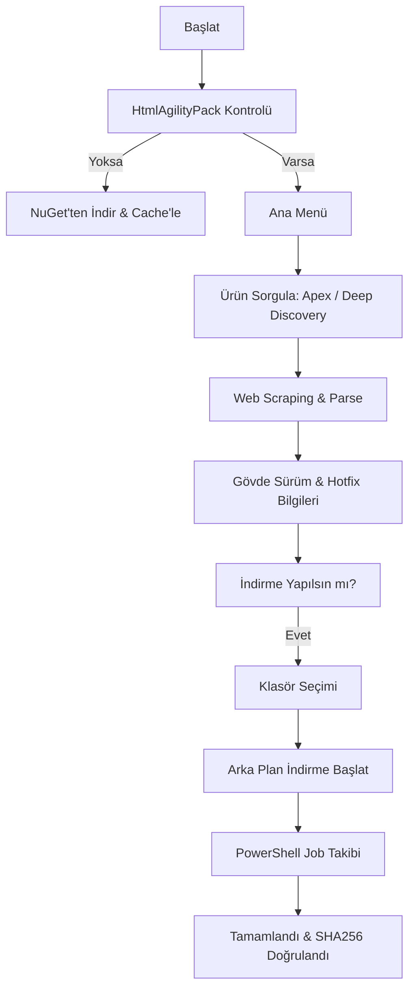

# TMDloadCheck.ps1 Kullanım Kılavuzu

`TMDloadCheck.ps1`, Trend Micro Download Center üzerinden en güncel Apex (One/Central) ve Deep Discovery (Analyzer/Director/Inspector/Email Inspector) paketlerini takip eden, SHA256 doğrulaması yapan ve asenkron (arka plan) indirme desteği sunan gelişmiş bir araçtır.

## 📋 Genel Bakış

Eski XPath bağımlı yöntemlerin aksine, bu script tablo-indeks bazlı dinamik ayrıştırma (parsing) yapar. `HtmlAgilityPack` kütüphanesini kullanarak Download Center verilerini güvenilir bir şekilde çeker.

### 🎨 Görsel Standartlar (Mebadi-i Aşere v2)

İndirme süreçleri ve durum takibi, Mebadi-i Aşere v2 standartlarına uygun görsel geri bildirimlerle cevherhane teması üzerinden gerçekleştirilir.

## 🛠 Kullanım

```powershell
.\TMDloadCheck.ps1
```

## 📊 Akış Diyagramı (Download Pipeline)



## ⚙️ Fonksiyonlar ve Değişkenler

### Temel Fonksiyonlar

| Fonksiyon | Görevi |
| :--- | :--- |
| **`Initialize-HtmlAgilityPack`** | HAP kütüphanesini local cache'e (`AppData`) indirir ve yükler. |
| **`Get-ProductInfo`** | Trend Micro web sayfasından sürüm, tarih ve link bilgilerini çeker. |
| **`Start-BackgroundDownload`** | İndirme işlemini bir PowerShell Job olarak arka planda başlatır. |
| **`Show-Status`** | Devam eden indirmelerin ilerleme durumunu gösterir. |
| **`Clear-AppCache`** | İndirilen kütüphane ve geçici dosyaları temizler. |

### Global Yapılandırma

- `$global:ScrapingProducts`: Ürün ID'lerini (Apex One, Central, DDAN, DDD, DDI, DDEI) ve Upgrade Path KB bağlantılarını içeren mapping tablosu.
- `$global:ActiveDownloads`: Aktif indirme işlerini takip eden liste.

## 📥 İndirme Özellikleri

1. **Klasör Seçimi**: Masaüstü, İndirilenler veya özel yol seçme imkanı sunar.
2. **Dosya Çatışma Yönetimi**: Aynı isimde dosya varsa üzerine yazma onayı sorar veya zaman damgalı yeni isim verir.
3. **Kesintisiz UI**: İndirme işlemi arka planda sürerken ana menüde gezinmeye devam edebilirsiniz.
4. **SHA256**: Web sitesinde yayınlanan hash değeri çekilerek indirme sonrası manuel doğrulama için hazır tutulur.
5. **Software Upgrade Path**: Deep Discovery ürünleri seçildiğinde, bakım ve yükseltme planlaması için ilgili resmi KB bağlantısı kullanıcıya sunulur.

## 🔐 Sistem Modifikasyonları ve Güvenlik

- **Kütüphane Cache**: `HtmlAgilityPack.dll` dosyası `%LOCALAPPDATA%\TrendMicroUpdateCheck` klasöründe saklanır.
- **İnternet Erişimi**: Scriptin çalışması için `downloadcenter.trendmicro.com` ve `nuget.org` (ilk kurulumda) adreslerine HTTPS erişimi gerekir.
- **Güvenlik**: İndirmeler `Invoke-WebRequest` ile yapılır, sistem proxy ayarları otomatik devralınır.
