# TMDloadCheck.ps1 Kullanım Kılavuzu

`TMDloadCheck.ps1`, Trend Micro Download Center üzerinden en güncel Apex (One/Central), Deep Security Manager (LTS) ve Deep Discovery (Analyzer/Director/Inspector/Email Inspector) paketlerini takip eden, SHA256 doğrulaması yapan ve asenkron (arka plan) indirme desteği sunan gelişmiş bir araçtır.

## 📋 Genel Bakış

Eski XPath bağımlı yöntemlerin aksine, bu script tablo-indeks bazlı dinamik ayrıştırma (parsing) yapar. `HtmlAgilityPack` kütüphanesini kullanarak Download Center verilerini güvenilir bir şekilde çeker. Deep Security paketleri için ise resmi manifest XML'lerini parse eder.

### 🎨 Görsel Standartlar (Mebadi-i Aşere v2)

İndirme süreçleri ve durum takibi, Mebadi-i Aşere v2 standartlarına uygun görsel geri bildirimlerle cevherhane teması üzerinden gerçekleştirilir.

## 🛠 Kullanım

```powershell
.\TMDloadCheck.ps1
```

## 📊 Akış Diyagramı (Download Pipeline)

```mermaid
graph TD
    Start[Başlat] --> Deps[HtmlAgilityPack Kontrolü]
    Deps -- Yoksa --> NuGet[NuGet'ten İndir & Cache'le]
    Deps -- Varsa --> Main[Ana Menü]
    
    Main --> Query[Ürün Sorgula: Apex / Deep Discovery / Deep Security]
    Query --> Scrape[Web Scraping & XML Parse]
    Scrape --> Display[Gövde Sürüm & Hotfix/Build Bilgileri]
    
    Display --> Ask[İndirme Yapılsın mı?]
    Ask -- Evet --> Path[Klasör Seçimi]
    Path --> Download[Arka Plan İndirme Başlat]
    
    Download --> Job[PowerShell Job Takibi]
    Job --> Finish[Tamamlandı & SHA256 Doğrulandı]
```



## ⚙️ Fonksiyonlar ve Değişkenler

### Temel Fonksiyonlar (v2.2.0)

| Fonksiyon | Görevi |
| :--- | :--- |
| **`Initialize-HtmlAgilityPack`** | HAP kütüphanesini local cache'e (`AppData`) indirir ve yükler. |
| **`Get-ProductInfo`** | Trend Micro web sayfasından sürüm, tarih ve link bilgilerini çeker. |
| **`Get-DeepSecurityManagerInfo`** | Deep Security Manager LTS sürümleri için XML manifestini parse eder. |
| **`Start-BackgroundDownload`** | İndirme işlemini bir PowerShell Job olarak arka planda başlatır. |
| **`Show-Status`** | Devam eden indirmelerin ilerleme durumunu gösterir. |
| **`Clear-AppCache`** | İndirilen kütüphane ve geçici dosyaları temizler. |

### Global Yapılandırma

- `$global:ScrapingProducts`: Ürün ID'lerini ve Upgrade Path KB bağlantılarını (DDAN, DDD, DDI, DDEI) içeren mapping tablosu.
- `$global:ActiveDownloads`: Aktif indirme işlerini takip eden liste.

## 📥 İndirme Özellikleri

1. **Geniş Ürün Desteği**: Apex, Deep Discovery ve Deep Security Manager (LTS) paketleri.
2. **Klasör Seçimi**: Masaüstü, İndirilenler veya özel yol seçme imkanı sunar.
3. **Dosya Çatışma Yönetimi**: Aynı isimde dosya varsa üzerine yazma onayı sorar veya zaman damgalı yeni isim verir.
4. **Kesintisiz UI**: İndirme işlemi arka planda sürerken ana menüde gezinmeye devam edebilirsiniz.
5. **SHA256**: Web sitesinde veya XML'de yayınlanan hash değeri çekilerek indirme sonrası manuel doğrulama için hazır tutulur.

## 🔐 Sistem Modifikasyonları ve Güvenlik

- **Kütüphane Cache**: `HtmlAgilityPack.dll` dosyası `%LOCALAPPDATA%\TrendMicroUpdateCheck` klasöründe saklanır.
- **İnternet Erişimi**: Scriptin çalışması için `downloadcenter.trendmicro.com`, `files.trendmicro.com` ve `nuget.org` (ilk kurulumda) adreslerine HTTPS erişimi gerekir.
- **Execution Policy**: Sistem politikasını kalıcı olarak değiştirmez.

> "Sübhaneke la ilmelena illa ma allemtena inneke entel alimul hakîm. (Bakara, 32)"
