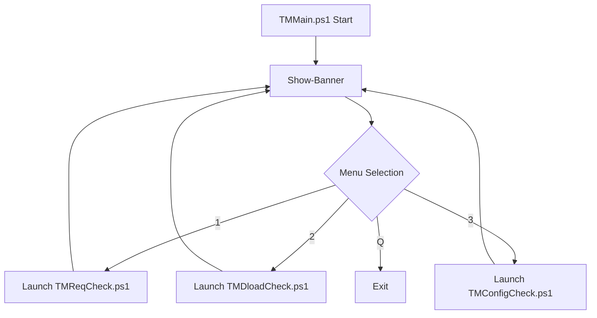

# TMMain.ps1 Kullanım Kılavuzu

`TMMain.ps1`, Trend Micro Apex One ve Central diagnostic araçları için merkezi bir yönetim panelidir (superset launcher). Tüm operasyonel scriptleri tek bir interaktif konsol üzerinden yönetmenizi sağlar.

## 📋 Genel Bakış

Bu script, "bab-ı kod" (cevherhane) standartlarına uygun olarak tasarlanmış olup, sistem yöneticilerine araçlar arasında hızlı geçiş yapma imkanı tanır.

### 🎨 Görsel Standartlar (Mebadi-i Aşere v2)

Tüm araçlar, **bab-ı kod** tarafından geliştirilen Mebadi-i Aşere v2 görsel standartlarını kullanır:

- **Banner Kalıbı:** DarkYellow (Altın) çerçeve ve Green (Zümrüt) metinler.
- **Besmele:** Merkezlenmiş ve yüksek kontrastlı Besmele-i Şerif.
- **Renk Paleti:** Cevherhane temasını yansıtan Altın, Zümrüt ve Elmas tonları.

## 🛠 Kullanım

Scripti **Administrator** yetkisiyle başlatmanız önerilir.

```powershell
.\TMMain.ps1
```

### Ana Menü Seçenekleri

1. **Pre-install Requirement Check (TMReqCheck.ps1)**: Kurulum öncesi ve sonrası kapsamlı diagnostic aracı.
2. **Download Center Check (TMDloadCheck.ps1)**: En güncel Trend Micro paketlerini sorgulama ve indirme paneli.
3. **Post-install Config Check (TMConfigCheck.ps1)**: Kurulum sonrası INI yapılandırmalarını güncelleme aracı.
Q. **Çıkış**: Paneli kapatır.

## 📊 Akış Diyagramı (Pipeline)



## ⚙️ Değişkenler ve Fonksiyonlar

### Değişkenler

| Değişken | Açıklama | Değer |
| :--- | :--- | :--- |
| `$scriptPath` | Scriptin çalıştığı dizin | `$PSScriptRoot` |
| `$colorEmerald` | Zümrüt Yeşili (Tema) | `DarkGreen` |
| `$colorDiamond` | Elmas Beyazı (Tema) | `White` |
| `$colorGold` | Altın Sarısı (Tema) | `Yellow` |
| `$secim` | Kullanıcı girişi | (Kullanıcı girdisi) |

### Fonksiyonlar

- **`Show-Banner`**: Konsolu temizler ve cevherhane ASCII sanatını, sürüm bilgisini ve mahlası (bab-ı kod) görüntüler.

## 🚀 İşleyiş Detayları

Script, seçtiğiniz aracı yeni bir PowerShell penceresinde (`Start-Process`) şu parametrelerle başlatır:

- `-ExecutionPolicy Bypass`: Scriptlerin kısıtlama olmadan çalışmasını sağlar.
- `-NoExit`: Arka plandaki script kapandığında pencerenin kalmasını sağlar (hata okuma için).
- `-Wait`: Script bitene kadar ana menüye dönülmesini bekletir.

## 🔐 Sistem Modifikasyonları

`TMMain.ps1` bir launcher (başlatıcı) olduğu için sistem üzerinde doğrudan bir değişiklik **yapmaz**. Yalnızca diğer scriptleri tetikler.
