# TMReqCheck.ps1 Kullanım Kılavuzu

`TMReqCheck.ps1`, Trend Micro Apex One ve Apex Central kurulumları için geliştirilmiş, hem kurulum öncesi (pre-install) hem de kurulum sonrası (post-install) süreçlerini kapsayan en gelişmiş diagnostic ve otomasyon aracıdır.

## 📋 Genel Bakış

Bu script, sistem gereksinimlerini kontrol etmenin ötesinde, kritik registry ayarlarını optimize eder, eksik Windows rollerini kurar ve güvenlik best-practice'lerini (IISCrypto) uygular.

## 🛠 Kullanım

Script **Administrator** yetkisi gerektirir.

```powershell
.\TMReqCheck.ps1 [-AutoFix] [-ProductType "ApexOne"|"ApexCentral"] [-ApplyIISCrypto]
```

### Parametreler

- `-AutoFix`: Tespit edilen sorunları (timezone, klavye, hostname vb.) kullanıcı onayı almadan otomatik düzeltir.
- `-ProductType`: Hedeflenen ürünü belirtir. Belirtilmezse menüden sorulur.
- `-ApplyIISCrypto`: IISCrypto "Best Practice" şablonunu sessizce uygular.
- `-LogPath`: Raporların ve logların kaydedileceği klasör (Varsayılan: `C:\ApexSetupLogs`).

## 📊 Akış Diyagramı (Diagnostic Pipeline)

```mermaid
graph TD
    Start((Başlat)) --> PrivCheck{Admin Yetkisi?}
    PrivCheck -- Hayır --> Exit[Hata & Çıkış]
    PrivCheck -- Evet --> Menu{İşlem Seçimi}
    
    Menu --> Check1[1. Pre-Install Checks]
    Menu --> Check2[2-12. Özel Modüller]
    Menu --> Check3[13-14. Kurulum Sonrası]
    Menu --> Check4[15. IISCrypto Setup]
    Menu --> Check5[16. Rapor Üret]

    subgraph "Diagnostic Modülleri"
        Check1 --> SYS[OS/CPU/RAM/Disk]
        Check2 --> REG[Regional/KB/TZ]
        REG --> TLS[SSL/TLS/HTTP2]
        TLS --> FEAT[Windows Features]
    end
    
    SYS --> Result{Hata Var mı?}
    REG --> Result
    TLS --> Result
    
    Result -- Evet & AutoFix --> Fix[Düzeltme Uygula]
    Result -- Evet & Manuel --> UI[Kullanıcı Onayı]
    
    Fix --> Report[Log Yaz]
    UI --> Report
    Report --> Menu
```



## ⚙️ Fonksiyonlar ve Değişkenler

### Kritik Fonksiyonlar

| Fonksiyon | Görevi | Düzeltme Kapasitesi |
| :--- | :--- | :--- |
| `Test-KeyboardLayout` | Turkish-Q klavye kontrolü | Evet (AutoFix) |
| `Test-RegionalSettings` | en-US culture & location kontrolü | Evet (AutoFix) |
| `Test-ClientAuthTrustMode` | Schannel registry (Value: 2) | Evet (AutoFix) |
| `Test-HTTP2Settings` | TLS/Cleartext HTTP2 devre dışı bırakma | Evet (AutoFix) |
| `Test-WindowsFeatures` | Eksik IIS ve MSMQ rollerini kurma | Evet (Install-WindowsFeature) |
| `Install-IISCryptoBP` | IISCrypto şablonu uygulama | Evet (CLI üzerinden) |
| `Test-IPv6Precedence` | IPv4 önceliği sağlama (0x20) | Evet (Registry) |
| `Test-ApexModules` | AC, EDS ve VP servis sağlık kontrolü | Görüntüleme |

### Global Değişkenler

- `$global:needsReboot`: Herhangi bir kritik ayar (hostname, IP priority, KB) değiştiğinde `$true` olur.
- `$global:ScriptResults`: Tüm test sonuçlarını anahtar/değer çifti olarak tutar.
- `$global:ExecutionErrors`: Çalışma esnasında oluşan tüm exception'ları toplar.

## 🔐 Sistem Modifikasyonları

Bu script sistem üzerinde şu değişiklikleri yapabilir:

1. **Registry**:
    - `HKLM\SYSTEM\CCSet\Control\SecurityProviders\Schannel` -> `ClientAuthTrustMode` = 2
    - `HKLM\SYSTEM\CCSet\Services\HTTP\Parameters` -> `EnableHttp2Tls/Cleartext` = 0
    - `HKLM\SYSTEM\CCSet\Services\Tcpip6\Parameters` -> `DisabledComponents` = 0x20
2. **Windows Roles**: `Web-Server`, `Web-ASP`, `MSMQ` vb. eksikse kurar.
3. **Regional**: Display language `en-US`, Klavye `Turkish-Q`, Location `US` ayarlar.
4. **Güvenlik**: `IISCryptoCli.exe` kullanarak sistem protokollerini (TLS 1.2+ zorlama) optimize eder.

## 📝 Raporlama

İşlem sonunda "16. Rapor Dışa Aktar" seçeneği ile `C:\ApexSetupLogs\apex_report_YYYYMMDD.txt` dosyasında tüm sistemin röntgenini görebilirsiniz.
